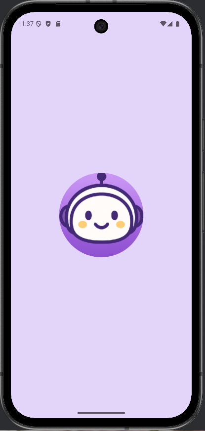
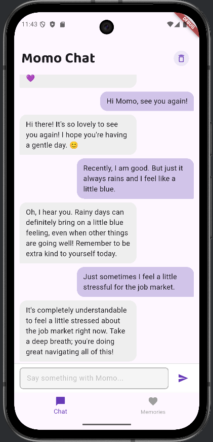
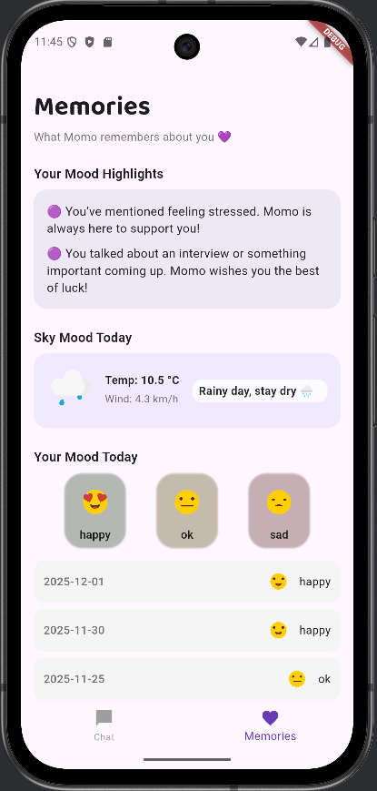

# 🟣 Momo Chat

## 📱 Project Description

**Momo Chat** is an AI-powered emotional companion mobile application built with Flutter.  
It allows users to chat with an AI assistant, track their daily mood, and view personalized emotional insights based on their conversations.

Momo is designed to act as a supportive companion — listening, remembering, and encouraging users through daily interactions.

---

## 🛠️ Technologies Used

### Front-End
- Flutter
- Dart

### Local Storage
- SQLite (sqflite)

### APIs
- Google Gemini API — AI conversational responses (LLM)
- Weather API — context-aware responses based on weather conditions

---

## ✨ Features

### 💬 Chat with AI (Momo)
- Real-time conversation with AI using Gemini LLM API
- Short, supportive, and empathetic responses
- Prompt-based personality design

---

### 🧠 Emotional Insights
- Analyzes recent user messages (last 20 chats)
- Detects keywords such as:
    - "tired"
    - "stress"
    - "interview"
- Generates supportive insights dynamically

---

### 🌤️ Weather-Aware Responses
- Fetches real-time weather data
- AI adjusts tone based on conditions
    - e.g. “Stay warm today ❄️”

---

### 😊 Mood Tracking
- Users can log daily mood:
    - 🙂 Happy
    - 😐 Neutral
    - ☹️ Sad
- Stored in local SQLite database
- Smooth UI interaction with animated buttons

---

### 📊 Memory Timeline
- Displays:
    - Mood history
    - Recent user messages
- Combines chat-based memories + mood logs
- Persistent data — remains after app restart

---

## 📸 Feature Demo

Here are some screenshots demonstrating the core features of Momo Chat:

### 💬 Landing Page


### 💬 Chat Experience


### 🧠 Momo Memories



## 💾 Persistent Storage

All data is stored locally using SQLite:

- Chat messages
- Mood logs
- Emotional insights source data

Data remains available after closing and reopening the app.

---

## 🔌 API Integration

### Google Gemini API
- Used for generating AI responses
- Implemented with:
    - HTTP POST requests
    - JSON parsing
    - Error handling
    - Prompt engineering

### Weather API
- Provides environmental context
- Enhances AI responses with real-world data

---

## ▶️ How to Run

1. Install dependencies:
```
flutter pub get
```

2. Run the app:
```
flutter run
```

3. Add your API keys:
- Gemini API key
- Weather API key

---

## 🎯 Project Highlights

- Multi-screen Flutter app with tab navigation
- Integration with Large Language Model (LLM)
- Local database with multiple tables
- Async API handling and error management
- Dynamic content generation based on user behavior

---

## 💜 Inspiration

Momo Chat is inspired by the idea that sometimes people just need a small companion —  
someone who listens, remembers, and cares.

---

## 🚀 Future Improvements

- Cloud sync (Firebase)
- Voice input / speech-to-text
- Smarter NLP (beyond keyword matching)
- Push notifications for mood reminders  

---

## 👤 Author

**Melissa Shao**

[](https://github.com/Melissa-Shao)

